# VoltGrid Backend Class Diagram

```mermaid
classDiagram
    direction TB

    class User {
        +Long id
        +String name
        +String email
        +String passwordHash
        +UserStatus status
        +LocalDateTime createdAt
        +updateProfile(name, email)
    }

    class Role {
        +Long id
        +String name
    }

    class Vehicle {
        +Long id
        +String make
        +String model
        +String connectorType
        +BigDecimal batteryCapacityKwh
        +BigDecimal maxChargingSpeedKw
        +Integer currentBatteryPercent
        +Boolean isDefault
    }

    class Station {
        +Long id
        +String name
        +String operatorName
        +String address
        +BigDecimal latitude
        +BigDecimal longitude
        +BigDecimal pricePerKwh
        +BigDecimal rating
        +Boolean active
    }

    class Charger {
        +Long id
        +String connectorType
        +ChargerType type
        +BigDecimal powerKw
        +ChargerStatus status
        +Integer queueLength
    }

    class FavoriteStation {
        +Long id
        +LocalDateTime createdAt
    }

    class StationReview {
        +Long id
        +Integer rating
        +String comment
        +ReviewStatus status
        +LocalDateTime createdAt
    }

    class ChargingSession {
        +Long id
        +SessionStatus status
        +Integer startBatteryPercent
        +Integer targetBatteryPercent
        +Integer currentBatteryPercent
        +BigDecimal energyKwh
        +BigDecimal pricePerKwh
        +BigDecimal totalCost
        +Integer durationMinutes
        +LocalDateTime startedAt
        +LocalDateTime completedAt
        +start()
        +updateProgress(percent)
        +stop()
    }

    class Payment {
        +Long id
        +BigDecimal amount
        +String providerReference
        +PaymentStatus status
        +LocalDateTime paidAt
    }

    class PaymentMethod {
        +Long id
        +PaymentMethodType type
        +String providerToken
        +Boolean isDefault
    }

    class ShopItem {
        +Long id
        +String name
        +String description
        +String amazonQuery
        +String externalUrl
        +Boolean active
    }

    class RecommendationPreferences {
        +Long id
        +Integer distanceWeight
        +Integer priceWeight
        +Integer speedWeight
        +Integer ratingWeight
        +Integer queueWeight
    }

    class Notification {
        +Long id
        +String title
        +String message
        +NotificationType type
        +Boolean read
        +LocalDateTime createdAt
    }

    class UserStatus {
        <<enumeration>>
        ACTIVE
        BLOCKED
        DELETED
    }

    class ChargerType {
        <<enumeration>>
        AC
        DC_FAST
    }

    class ChargerStatus {
        <<enumeration>>
        AVAILABLE
        IN_USE
        OFFLINE
    }

    class SessionStatus {
        <<enumeration>>
        CREATED
        ACTIVE
        COMPLETED
        CANCELLED
    }

    class PaymentStatus {
        <<enumeration>>
        PENDING
        SUCCESS
        FAILED
        REFUNDED
    }

    class ReviewStatus {
        <<enumeration>>
        PENDING
        APPROVED
        REJECTED
    }

    class UserRepository {
        <<interface>>
        +findByEmail(email)
        +existsByEmail(email)
    }

    class VehicleRepository {
        <<interface>>
        +findByUserId(userId)
    }

    class StationRepository {
        <<interface>>
        +search(filters)
        +findNearby(latitude, longitude, radiusKm)
    }

    class ChargingSessionRepository {
        <<interface>>
        +findActiveByUserId(userId)
        +findHistoryByUserId(userId)
    }

    class UserService {
        +register(request)
        +getCurrentUser(userId)
        +updateProfile(userId, request)
        +changePassword(userId, request)
    }

    class VehicleService {
        +listVehicles(userId)
        +addVehicle(userId, request)
        +updateVehicle(userId, vehicleId, request)
        +deleteVehicle(userId, vehicleId)
    }

    class StationService {
        +searchStations(filters)
        +getStation(stationId)
        +getNearbyStations(location)
        +getAvailability(stationId)
    }

    class FavoriteService {
        +addFavorite(userId, stationId)
        +removeFavorite(userId, stationId)
        +listFavorites(userId)
    }

    class ChargingService {
        +calculateCost(request)
        +estimateChargingTime(request)
        +startSession(userId, request)
        +getActiveSession(userId)
        +updateProgress(userId, sessionId, request)
        +stopSession(userId, sessionId)
        +getHistory(userId, filters)
        +getSummary(userId, filters)
    }

    class RecommendationService {
        +rankStations(userId, request)
        +scoreStation(station, vehicle, preferences)
    }

    class PaymentService {
        +createPayment(userId, sessionId)
        +getPaymentStatus(userId, paymentId)
        +generateInvoice(userId, paymentId)
    }

    class ReviewService {
        +createReview(userId, stationId, request)
        +listApprovedReviews(stationId)
    }

    class AuthService {
        +register(request)
        +login(request)
        +refreshToken(token)
    }

    class UserController {
        +getMe()
        +updateProfile(request)
        +changePassword(request)
    }

    class VehicleController {
        +getVehicles()
        +createVehicle(request)
        +updateVehicle(id, request)
        +deleteVehicle(id)
    }

    class StationController {
        +search(filters)
        +getById(id)
        +getNearby(location)
        +getAvailability(id)
    }

    class ChargingController {
        +calculateCost(request)
        +estimateTime(request)
        +start(request)
        +active()
        +progress(id, request)
        +stop(id)
        +history(filters)
        +summary(filters)
    }

    class RecommendationController {
        +recommend(request)
    }

    class AuthController {
        +register(request)
        +login(request)
        +refresh(request)
    }

    User "1" --> "many" Vehicle : owns
    User "1" --> "many" FavoriteStation : saves
    Station "1" --> "many" FavoriteStation : is saved as
    User "1" --> "many" ChargingSession : starts
    Station "1" --> "many" ChargingSession : hosts
    Station "1" --> "many" Charger : contains
    User "1" --> "many" StationReview : writes
    Station "1" --> "many" StationReview : receives
    ChargingSession "1" --> "0..1" Payment : creates
    User "1" --> "many" PaymentMethod : owns
    User "1" --> "many" Notification : receives
    User "1" --> "1" RecommendationPreferences : configures
    User "many" -- "many" Role : has

    User --> UserStatus
    Charger --> ChargerType
    Charger --> ChargerStatus
    ChargingSession --> SessionStatus
    Payment --> PaymentStatus
    StationReview --> ReviewStatus

    AuthController --> AuthService
    UserController --> UserService
    VehicleController --> VehicleService
    StationController --> StationService
    ChargingController --> ChargingService
    RecommendationController --> RecommendationService

    AuthService --> UserRepository
    UserService --> UserRepository
    VehicleService --> VehicleRepository
    StationService --> StationRepository
    ChargingService --> ChargingSessionRepository
    ChargingService --> StationRepository
    RecommendationService --> StationService
    PaymentService --> ChargingSessionRepository
```



## Suggested Java package structure

```text
com.voltgrid
├── auth
│   ├── AuthController.java
│   ├── AuthService.java
│   ├── JwtService.java
│   └── SecurityConfig.java
├── user
│   ├── User.java
│   ├── Role.java
│   ├── UserController.java
│   ├── UserService.java
│   └── UserRepository.java
├── vehicle
├── station
├── favorite
├── charging
├── recommendation
├── payment
├── review
├── shop
├── notification
└── common
    ├── ApiExceptionHandler.java
    └── ApiResponse.java
```

## Implementation order

1. `User`, `Role`, authentication, JWT security
2. `Vehicle` and profile APIs
3. `Station`, `Charger`, search and nearby-station APIs
4. `FavoriteStation` and recommendation service
5. `ChargingSession` and cost calculator
6. `Payment`, history and invoice APIs
7. Reviews, notifications, shop and admin APIs
