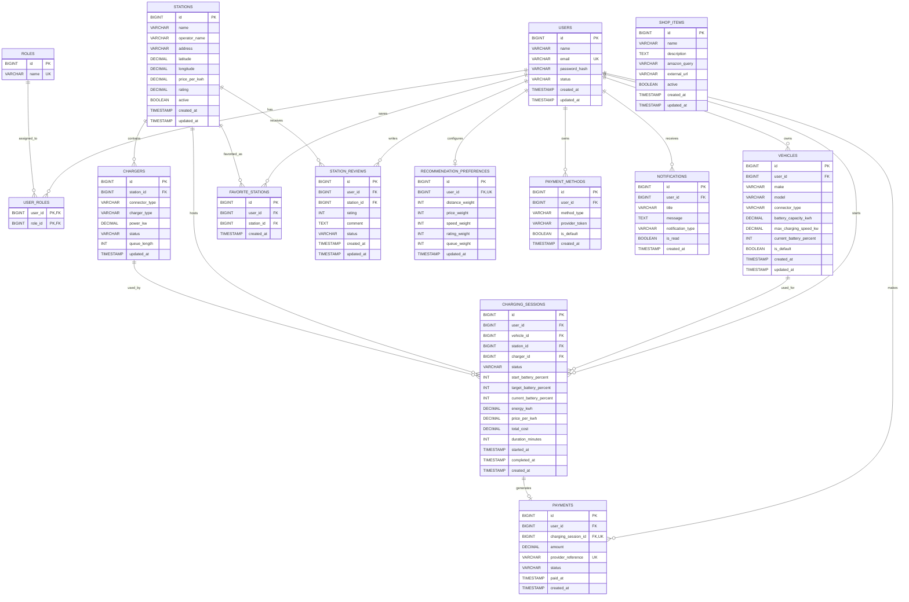

# VoltGrid Backend Entity Relationship Diagram

This ER diagram shows the recommended relational database structure for the VoltGrid Java backend.

## Relationship summary

| Relationship | Meaning |
|---|---|
| `USERS` to `VEHICLES` | One user can register multiple vehicles. |
| `STATIONS` to `CHARGERS` | One station can contain multiple chargers. |
| `USERS` to `STATIONS` | Users save stations through `FAVORITE_STATIONS`. |
| `USERS` to `STATIONS` | Users review stations through `STATION_REVIEWS`. |
| `USERS` to `CHARGING_SESSIONS` | A user can have multiple charging sessions. |
| `CHARGING_SESSIONS` to `PAYMENTS` | A completed charging session can generate one payment. |
| `USERS` to `ROLES` | Users and roles use the `USER_ROLES` many-to-many join table. |
| `USERS` to `RECOMMENDATION_PREFERENCES` | Each user can have one recommendation preference record. |

## Important database constraints

- `users.email` must be unique.
- `roles.name` must be unique.
- `user_roles(user_id, role_id)` must be a composite primary key.
- `favorite_stations(user_id, station_id)` should be unique to prevent duplicate favorites.
- `recommendation_preferences.user_id` must be unique.
- `payments.charging_session_id` should be unique when one session produces one payment.
- Battery percentages must be between `0` and `100`.
- Station latitude must be between `-90` and `90`.
- Station longitude must be between `-180` and `180`.
- Rating must be between `1` and `5`.
- Charger power, battery capacity, energy, price and payment amount must not be negative.
